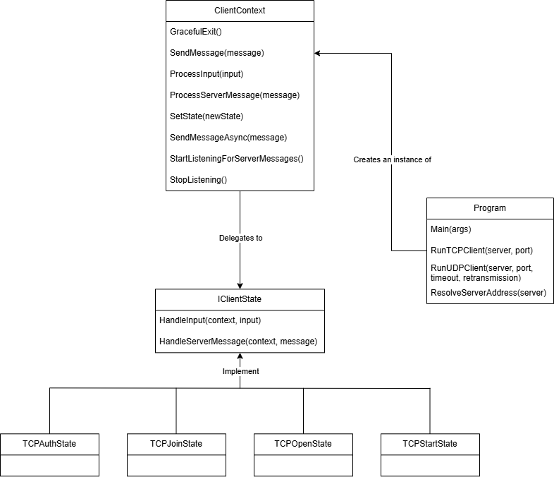
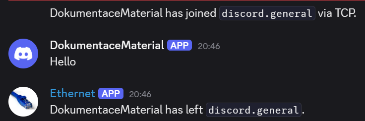
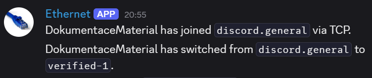

# IPK25-CHAT Documentation

## Table of Contents
1. [Executive Summary](#executive-summary)
2. [Theory Overview](#theory-overview)
3. [Code Structure](#code-structure)
4. [Class Diagram](#class-diagram)
4. [Testing](#testing)
5. [Bibliography](#bibliography)

---

## Executive Summary

The `ipk25chat-client` application is a command-line chat client implemented in C#. The application allows users to authenticate, join channels, and exchange messages with other users. The functionality is implemented using a finite state machine, where the client transitions between various states (e.g., `StartState`, `AuthState`, `JoinState`, `OpenState`) based on the server's responses. Due to bad initial design and time pressure from other subjects, the client supports only TCP protocol, for insight into UDP variant code please consult my Gitea repository (main branch)[1].

### Key Features
- Support for both TCP protocol.
- State-based design for handling client-server interactions.
- Graceful handling of server responses and errors.
- Configurable timeout and retransmission settings for UDP.

---

## Theory Overview

### Networking Protocols
**TCP** (Transmission Control Protocol) is a reliable, connection-oriented protocol designed for scenarios where data integrity and delivery assurance are critical. It establishes a persistent connection between the client and server using a three-way handshake, ensuring that all transmitted packets arrive in order and without corruption. TCP handles packet retransmission, flow control, and congestion management, making it suitable for tasks like user authentication or message synchronization.

**UDP** (User Datagram Protocol) is a lightweight, connectionless protocol optimized for low-latency and high-throughput communication. Unlike TCP, it does not guarantee packet delivery, order, or integrity. This reduced overhead allows faster message delivery, ideal for real-time applications or non-critical data. UDP is useful for rapid initiation or control messages that can tolerate some loss.

### FSM Design
The client application is structured around a Finite State Machine (FSM) architecture to manage its behavior during interaction with the server. Each distinct phase of the client's lifecycle—such as connection initialization, authentication, or message exchange—is represented as a state within this FSM.

Each state is encapsulated as a class that implements the IClientState interface. This interface defines two core responsibilities:

HandleInput(ClientContext context, string input): Processes user commands or inputs relevant to the current state.

HandleServerMessage(ClientContext context, string message): Handles incoming messages from the server and determines appropriate responses or transitions.

As the client communicates with the server, it transitions between states based on external events (e.g., server responses) and internal conditions (e.g., user commands). This design enables clean separation of logic, improves maintainability, and makes the system extensible for additional protocols or features.

By modeling the client as a finite state machine, the application gains:
- Clear and predictable control flow
- Decoupling of logic for different connection phases
- Ease of testing and debugging individual states

### Message Format
- **TCP**: Messages are sent as plain text strings.
- **UDP**: Messages are sent as structured byte arrays with specific fields (e.g., `MessageID`, `Result`, `MessageContents`).

---

## Code Structure

### Key Components
- **`Program.cs`**: Entry point of the application. Handles argument parsing and initializes the client.
- **`ClientContext.cs`**: Manages the current state of the client and provides methods for sending and receiving messages.
- **`IClientState.cs`**: Interface defining methods for handling input and server messages.
- **State Classes**:
  - `TCPStartState`: Initial state of the client.
  - `TCPAuthState`: Handles user authentication.
  - `TCPJoinState`: Manages joining a channel.
  - `TCPOpenState`: Allows sending and receiving messages.

---

## Class Diagram

---

## Testing

### Test Cases

### Manual tests
- These tests are based on assignment examples and logical use-cases.

#### 1. Basic connection
- **Input**: `./ipk25chat-client -t tcp -s 127.0.0.1`
- **Expected Output**: Successful connection to the server on default port.
- **Output**: As expected.

#### 2. Connection to specific port
- **Input**: `./ipk25chat-client -t tcp -s 127.0.0.1 -p 12345`
- **Expected Output**: Successful connection to the server specified port.
- **Output**: As expected.

#### 3. Invalid Server Address
- **Input**: `./ipk25chat-client -t tcp -s invalid_address`
- **Expected Output**: Error message indicating the server address could not be resolved.
- **Output**: As expected.

#### 4. Missing Required Arguments
- **Input**: `./ipk25chat-client -t tcp -s 127.0.0.1 -p`
- **Expected Output**: Error message indicating that the port argument is missing.
- **Output**: As expected.

#### 5. Invalid Port Number
- **Input**: `./ipk25chat-client -t tcp -s 127.0.0.1 -p invalid_port`
- **Expected Output**: Error message indicating that the port number is invalid.
- **Output**: As expected.

#### 6. State Transitions
- **Scenario**: Authenticate, join a channel, and send a message.
- **Expected Behavior**: The client transitions through `AuthState`, `JoinState`, and `OpenState` successfully.
- **Output**: As expected.

#### 7. Graceful Exit
- **Scenario**: Press `Ctrl+C` during execution.
- **Expected Behavior**: The client sends a `BYE` message to the server and exits cleanly.
- **Output**: As expected.

#### 8. Invalid Commands
- **Input**: Enter an invalid command (e.g., `/invalid`).
- **Expected Output**: Error message indicating that the command is not recognized.
- **Output**: As expected.

#### 9. Sending a Message
- **Scenario**: Authenticate, join a channel, and send a message (e.g., `Hello, world!`).
- **Expected Behavior**: The message is sent to the server and displayed to other users in the channel.
- **Output**: As expected.

#### 10. Server Disconnection
- **Scenario**: The server sends a `BYE` message to the client, signaling a termination of connection.
- **Expected Behavior**: The client detects the message and exits gracefully.
- **Output**: As expected.

---

### Automated tests
- A series of automated tests for TCP variants of the assignment.
- **Output**: 100% completion.

---

### Tests in a practical enviroment
- Testing on a public reference discord server

#### 1. Sending a message
- **Scenario**: Joining the server, authorizing, sending a message in default server, terminating the client.
- **Expected behaviour**: Join, authorize, send message, seeing a disconnect message after terminating.
- **Real behaviour**: As expected.

#### 2. Joining a channel
- **Scenario**: Joining the server, authorizing, joining a different channel with /join.
- **Expected behaviour**: Join, authorize, see a message confirming join.
- **Real behaviour**: As expected.

---

### Testing Tools
- **Netcat**: Used to simulate a server for testing TCP communication.
- **Wireshark**: Used to inspect network packets and verify message formats.
- **Public reference server (Discord)**: Used to test communication in a real environment.

---

## Bibliography

1. **C# Documentation**:
   - [Microsoft C# Documentation](https://learn.microsoft.com/en-us/dotnet/csharp/)
2. **Networking in C#**:
   - [Microsoft .NET Networking Guide](https://learn.microsoft.com/en-us/dotnet/framework/network-programming/)
3. **Makefile Basics**:
   - [GNU Make Manual](https://www.gnu.org/software/make/manual/make.html)
4. **UDP and TCP Protocols**:
   - [RFC 768 - User Datagram Protocol](https://tools.ietf.org/html/rfc768)
   - [RFC 793 - Transmission Control Protocol](https://tools.ietf.org/html/rfc793)
5. **Wireshark**:
   - [Wireshark User Guide](https://www.wireshark.org/docs/wsug_html_chunked/)
6. **Markdown Guide**:
   - [Markdown Guide](https://www.markdownguide.org/)
7. **ChatGPT**:
    - Used as a smart debugger [https://chatgpt.com](https://chatgpt.com)

---

## Referrals
1. **Project Gitea repository**
   - [https://git.fit.vutbr.cz/xzavadt00/IPK_projekt2](https://git.fit.vutbr.cz/xzavadt00/IPK_projekt2)
2. **Unofficial Automated Tests**:
   - MALASHCHUK Vladyslav, Tomáš HOBZA, et al. VUT_IPK_CLIENT_TESTS [online]. GitHub, 2025 [cit. 2025-04-16]. Available at: [https://github.com/Vlad6422/VUT_IPK_CLIENT_TESTS](https://github.com/Vlad6422/VUT_IPK_CLIENT_TESTS)